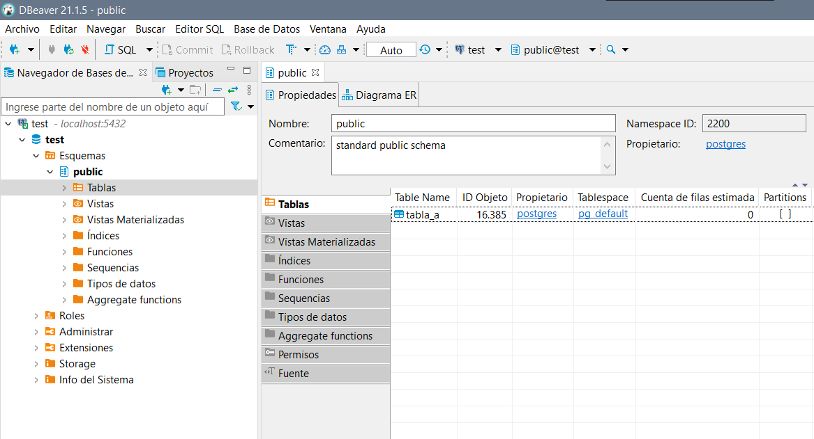

## Trabajo Práctico 2 - Introducción a Docker

### 1- Objetivos de Aprendizaje
 - Familiarizarse con la tecnología de contendores 
 - Ejercitar comandos básicos de Docker.

### 2- Unidad temática que incluye este trabajo práctico
Este trabajo práctico corresponde a la unidad Nº: 2 (Libro Ingeniería de Software: Unidad 18)

### 3- Consignas a desarrollar en el trabajo práctico:

A continuación, se presentarán algunos conceptos generales de la tecnología de contenedores a manera de introducción al tema desde el punto de vista práctico.

#### ¿Que son los contenedores?

Los contenedores son paquetes de software. Ellos contienen la aplicación a ejecutar junto con las librerías, archivos de configuración, etc para que esta aplicación pueda ser ejecutada. Estos contenedores utilizan características del sistema operativo, por ejemplo, cgroups, namespaces y otros aislamientos de recursos (sistema de archivos, red, etc) para proveer un entorno aislado de ejecución de dicha aplicación.

Dado que ellos utilizan el kernel del sistema operativo en el que se ejecutan, no tienen el elevado consumo de recursos que por ejemplo tienen las máquinas virtuales, las cuales corren su propio sistema operativo.

#### ¿Que es docker?

Docker es una herramienta que permite el despliegue de aplicaciones en contenedores. Además, provee una solución integrada tanto para la ejecución como para la creación de contenedores entre otras muchas funcionalidades.

#### ¿Porque usar contenedores?

Los contenedores ofrecen un mecanismo de empaquetado lógico en el cual las aplicaciones pueden estar aisladas del entorno en el cual efectivamente se ejecutan. Este desacoplamiento permite a las aplicaciones en contenedores ser desplegadas de manera simple y consistente independientemente de si se trata de un Data Center privado, una Cloud publica, o una computadora de uso personal. Esto permite a los desarrolladores crear entornos predecibles que están aislados del resto de las aplicaciones y pueden ser ejecutados en cualquier lugar.

Por otro lado, ofrecen un control más fino de los recursos y son más eficientes al momento de la ejecución que una máquina virtual.

En los últimos años el uso de contenedores ha crecido exponencialmente y fue adoptado de forma masiva por prácticamente todas las compañías importantes de software.

#### Máquinas Virtuales vs Contenedores 

Los contenderos no fueron pensados como un remplazo de las máquinas virtuales. Cuando ambas tecnologías se utilizan en forma conjunta se obtienen los mejores resultados, por ejemplo, en los proveedores cloud como AWS, Google Cloud o Microsoft Azure.

![alt text][imagen]

[imagen]: vms-vs-containers.png

(Imagen: https://blog.docker.com/2016/04/containers-and-vms-together/ )


##### Analogía

![alt text][imagen3]

[imagen3]: vms-containers-analogy.png

(Imagen: https://github.com/SteveLasker/Presentations/tree/master/DockerCon2017 )

#### Conceptos Generales

- **Container Image**: Una imagen contiene el sistema operativo base, la aplicación y todas sus dependencias necesarias para un despliegue rápido del contenedor.
- **Container**: Es una instancia en ejecución de una imagen.
- **Container Registry**: Las imágenes de Docker son almacenadas en un Registry y pueden ser descargadas cuando se necesitan. Un registry pude ser público, por ejemplo, DockerHub o instalado en un entorno privado.
- **Docker Daemon**: el servicio en segundo plano que se ejecuta en el host que gestiona la construcción, ejecución y distribución de contenedores Docker. El daemon es el proceso que se ejecuta en el sistema operativo con el que los clientes hablan.
- **Docker Client**: la herramienta de línea de comandos que permite al usuario interactuar con el daemon. En términos más generales, también puede haber otras formas de clientes, como Kitematic, que proporciona una GUI a los usuarios. 
- **Dockerfile**: Son usados por los desarrolladores para automatizar la creación de imágenes de contenedores. Con un Dockerfile, el demonio de Docker puede automáticamente construir una imagen.

#### Layers en Docker

Las imágenes de docker están compuestas de varias capas (layers) de sistemas de archivos y agrupadas juntas. Estas son de solo lectura. Cuando se crea el contenedor, Docker monta un sistema de archivos de lectura/escritura sobre estas capas el cual es utilizado por los procesos dentro del contenedor. Cuando el contenedor es borrado, esta capa es borrada con él, por lo tanto, son necesarias otras soluciones para persistir datos en forma permanente.

![alt text][imagen2]

[imagen2]: docker-image.png

(Imagen: https://washraf.gitbooks.io/the-docker-ecosystem/content/Chapter%201/Section%203/union_file_system.html)

## 4- Desarrollo:

#### 1- Instalar Docker Community Edition 
  - Diferentes opciones para cada sistema operativo
  - https://docs.docker.com/
  - Ejecutar el siguiente comando para comprobar versiones de cliente y demonio.
```bash
docker version
```
**Resolución**
```bash
PS C:\Users\Abril> docker version
Client:
 Cloud integration: 1.0.17
 Version:           20.10.7
 API version:       1.41
 Go version:        go1.16.4
 Git commit:        f0df350
 Built:             Wed Jun  2 12:00:56 2021
 OS/Arch:           windows/amd64
 Context:           default
 Experimental:      true

Server: Docker Engine - Community
 Engine:
  Version:          20.10.7
  API version:      1.41 (minimum version 1.12)
  Go version:       go1.13.15
  Git commit:       b0f5bc3
  Built:            Wed Jun  2 11:54:58 2021
  OS/Arch:          linux/amd64
  Experimental:     false
 containerd:
  Version:          1.4.6
  GitCommit:        d71fcd7d8303cbf684402823e425e9dd2e99285d
 runc:
  Version:          1.0.0-rc95
  GitCommit:        b9ee9c6314599f1b4a7f497e1f1f856fe433d3b7
 docker-init:
  Version:          0.19.0
  GitCommit:        de40ad0
  ```

#### 2- Explorar DockerHub
   - Registrase en docker hub: https://hub.docker.com/
   - Familiarizarse con el portal

#### 3- Obtener la imagen BusyBox
  - Ejecutar el siguiente comando, para bajar una imagen de DockerHub
  ```bash
  docker pull busybox
  ```
  - Verificar qué versión y tamaño tiene la imagen bajada, obtener una lista de imágenes locales:
```bash
docker images
```
**Resolución**
```bash
PS C:\Users\Abril> docker pull busybox
Using default tag: latest
latest: Pulling from library/busybox
b71f96345d44: Pull complete
Digest: sha256:0f354ec1728d9ff32edcd7d1b8bbdfc798277ad36120dc3dc683be44524c8b60
Status: Downloaded newer image for busybox:latest
docker.io/library/busybox:latest
PS C:\Users\Abril> docker images
REPOSITORY          TAG       IMAGE ID       CREATED         SIZE
busybox             latest    69593048aa3a   2 months ago    1.24MB
docker101tutorial   latest    fc5911ab9428   9 months ago    27MB
alpine/git          latest    a8b6c5c0eb62   10 months ago   28.4MB
```

#### 4- Ejecutando contenedores
  - Ejecutar un contenedor utilizando el comando **run** de docker:
```bash
docker run busybox
```

  - Explicar porque no se obtuvo ningún resultado

  **Resolución**

  *No se obtuvo resultado porque el comando creó el contenedor, lo arrancó, ejecutó todos los comandos especificados (que en este caso no fue ninguno) y al terminar con ellos paró el contenedor*


  - Especificamos algún comando a correr dentro del contendor, ejecutar por ejemplo:
```bash
docker run busybox echo "Hola Mundo"
```
**Resolución**
```bash
PS C:\Users\Abril> docker run busybox echo "Hola Mundo"
Hola Mundo
```

  - Ver los contendores ejecutados utilizando el comando **ps**:
```bash
docker ps
```
**Resolución**
```bash
PS C:\Users\Abril> docker ps
CONTAINER ID   IMAGE     COMMAND   CREATED   STATUS    PORTS     NAMES
```
  - Vemos que no existe nada en ejecución, correr entonces:
```bash
docker ps -a
```
  - Mostrar el resultado y explicar que se obtuvo como salida del comando anterior.

**Resolución**
```bash
PS C:\Users\Abril> docker ps -a
CONTAINER ID   IMAGE               COMMAND                  CREATED         STATUS                      PORTS                NAMES
74578e35ea0e   busybox             "echo 'Hola Mundo'"      5 minutes ago   Exited (0) 5 minutes ago                         wizardly_tesla
a5d64e92aeef   busybox             "sh"                     3 hours ago     Exited (0) 3 hours ago                           thirsty_chandrasekhar
c07de270f443   docker101tutorial   "/docker-entrypoint.…"   9 months ago    Exited (255) 9 months ago   0.0.0.0:80->80/tcp   docker-tutorial
cb606b734d27   alpine/git          "git clone https://g…"   9 months ago    Exited (0) 9 months ago                          repo
```
*El comando **docker ps** lista los contenedores en estado running, con el parámetro **-a** o **--all** se listan todos los contenedores independientemente de su estado.* 


#### 5- Ejecutando en modo interactivo

  - Ejecutar el siguiente comando
```bash
docker run -it busybox sh
```
  - Para cada uno de los siguientes comandos dentro de contenedor, mostrar los resultados:
```bash
ps
uptime
free
ls -l /
```

**Resolución**
```bash
/ # ps
PID   USER     TIME  COMMAND
    1 root      0:00 sh
    7 root      0:00 ps
/ # uptime
 22:22:01 up  4:16,  0 users,  load average: 0.39, 0.18, 0.06
/ # free
              total        used        free      shared  buff/cache   available
Mem:       12993900      620616    10707744      411124     1665540    11700608
Swap:       4194304           0     4194304
/ # ls -l
total 36
drwxr-xr-x    2 root     root         12288 Jun  7 17:34 bin
drwxr-xr-x    5 root     root           360 Aug 18 21:37 dev
drwxr-xr-x    1 root     root          4096 Aug 18 21:37 etc
drwxr-xr-x    2 nobody   nobody        4096 Jun  7 17:34 home
dr-xr-xr-x  197 root     root             0 Aug 18 21:37 proc
drwx------    1 root     root          4096 Aug 18 22:21 root
dr-xr-xr-x   11 root     root             0 Aug 18 21:37 sys
drwxrwxrwt    2 root     root          4096 Jun  7 17:34 tmp
drwxr-xr-x    3 root     root          4096 Jun  7 17:34 usr
drwxr-xr-x    4 root     root          4096 Jun  7 17:34 var
```

  - Salimos del contendor con:
```bash
exit
```

#### 6- Borrando contendores terminados

  - Obtener la lista de contendores 
```bash
docker ps -a
```
  - Para borrar podemos utilizar el id o el nombre (autogenerado si no se especifica) de contendor que se desee, por ejemplo:
```bash
docker rm elated_lalande
```
  - Para borrar todos los contendores que no estén corriendo, ejecutar cualquiera de los siguientes comandos:
```bash
docker rm $(docker ps -a -q -f status=exited)
```
```bash
docker container prune
```

#### 7- Montando volúmenes

Hasta este punto los contenedores ejecutados no tenían contacto con el exterior, ellos corrían en su propio entorno hasta que terminaran su ejecución. Ahora veremos cómo montar un volumen dentro del contenedor para visualizar por ejemplo archivos del sistema huésped:

  - Ejecutar el siguiente comando, cambiar myusuario por el usuario que corresponda. En linux/Mac puede utilizarse /home/miusuario):
```bash
docker run -it -v C:\Users\misuario\Desktop:/var/escritorio busybox /bin/sh
```
  - Dentro del contenedor correr
```bash
ls -l /var/escritorio
touch /var/escritorio/hola.txt
```
  - Verificar que el Archivo se ha creado en el escritorio o en el directorio home según corresponda.

  **Resolución**
  ```bash
  / # ls -l /var/escritorio
total 1831868
-rw-r--r--    1 root     root             0 Aug 18 22:39 hola.txt
  ```

#### 8- Publicando puertos

En el caso de aplicaciones web o base de datos donde se interactúa con estas aplicaciones a través de un puerto al cual hay que acceder, estos puertos están visibles solo dentro del contenedor. Si queremos acceder desde el exterior deberemos exponerlos.

  - Ejecutar la siguiente imagen, en este caso utilizamos la bandera -d (detach) para que nos devuelva el control de la consola:

```bash
docker run -d daviey/nyan-cat-web
```
  - Si ejecutamos un comando ps:
```bash
PS D:\> docker ps
CONTAINER ID        IMAGE                 COMMAND                  CREATED             STATUS              PORTS               NAMES
87d1c5f44809        daviey/nyan-cat-web   "nginx -g 'daemon of…"   2 minutes ago       Up 2 minutes        80/tcp, 443/tcp     compassionate_raman
```
  - Vemos que el contendor expone 2 puertos el 80 y el 443, pero si intentamos en un navegador acceder a http://localhost no sucede nada.

  - Procedemos entonces a parar y remover este contenedor:
```bash
docker kill compassionate_raman
docker rm compassionate_raman
```
  - Vamos a volver a correrlo otra vez, pero publicando uno de los puertos solamente, el este caso el 80

```bash
docker run -d -p 80:80 daviey/nyan-cat-web
```
  - Accedamos nuevamente a http://localhost y expliquemos que sucede.

**Resolución**


*Lo que sucedió en primera instancia es que, por defecto, cuando se crea o corre un contenedor este no se publica al "exterior". Con el parámetro **-p** o **--publish** le indicamos que este debe publicarse en un puerto del host, de esta forma se crea una regla que mapea el puerto del contenedor a algún puerto de host, en este ejemplo se mapeo el puerto 80 del contenedor con el puerto 80 del host y es por esto que el proceso se puede visualizar desde el host en localhost:80*


#### 9- Utilizando una base de datos
- Levantar una base de datos PostgreSQL

```bash
mkdir $HOME/.postgres

docker run --name my-postgres -e POSTGRES_PASSWORD=mysecretpassword -v $HOME/.postgres:/var/lib/postgresql/data -p 5432:5432 -d postgres:9.4
```
- Ejecutar sentencias utilizando esta instancia

```bash
docker exec -it my-postgres /bin/bash

psql -h localhost -U postgres

#Estos comandos se corren una vez conectados a la base

\l
create database test;
\connect test
create table tabla_a (mensaje varchar(50));
insert into tabla_a (mensaje) values('Hola mundo!');
select * from tabla_a;

\q

exit
```

**Resolución**
```bash
postgres=# create database test;
CREATE DATABASE
postgres=# \l
                                 List of databases
   Name    |  Owner   | Encoding |  Collate   |   Ctype    |   Access privileges
-----------+----------+----------+------------+------------+-----------------------
 postgres  | postgres | UTF8     | en_US.utf8 | en_US.utf8 |
 template0 | postgres | UTF8     | en_US.utf8 | en_US.utf8 | =c/postgres          +
           |          |          |            |            | postgres=CTc/postgres
 template1 | postgres | UTF8     | en_US.utf8 | en_US.utf8 | =c/postgres          +
           |          |          |            |            | postgres=CTc/postgres
 test      | postgres | UTF8     | en_US.utf8 | en_US.utf8 |
(4 rows)

postgres=# \connect test
You are now connected to database "test" as user "postgres".
test=# create table tabla_a (mensaje varchar(50))
test-# ;
CREATE TABLE
test=# insert into tabla_a (mensaje) values('Hola mundo!');
INSERT 0 1
test=# select * from tabla_a;
   mensaje
-------------
 Hola mundo!
(1 row)

test=# \q
root@2cc6a4dc068f:/# exit
exit
```

- Conectarse a la base utilizando alguna IDE (Dbeaver - https://dbeaver.io/, eclipse, IntelliJ, etc...). Interactuar con los objetos creados.

**Resolución**




- Explicar que se logro con el comando `docker run` y `docker exec` ejecutados en este ejercicio.

**Resolución**

***docker run** inicia una instancia de postgres, definiendo la variable de entorno password para el superusuario (por defecto postgres), también se especifica en qué puerto será publicado al host.*

***docker exec** ejecuta un comando en un contenedor en ejecución, en este caso en my-postgres. En este caso se abre en modo interactivo debido al parámetro **-i**.*

*Mientras **run** inicia un nuevo contenedor, **exec** inicia un proceso o comando dentro de un contenedor existente y en ejecución.*

#### 10- Presentación del trabajo práctico.

Subir un archivo md (puede ser en una carpeta) trabajo-practico-02 con las salidas de los comandos utilizados. Si es necesario incluir también capturas de pantalla.
