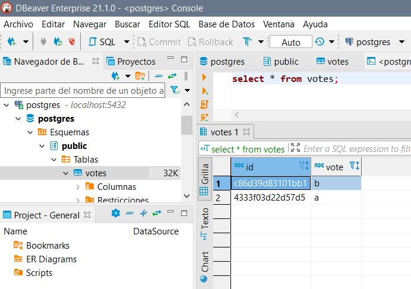

## Trabajo Práctico 3 - Arquitectura de Sistemas Distribuidos

### 1- Objetivos de Aprendizaje
 - Familiarizarse con conceptos de Sistemas Distribuidos
 - Utilización avanzada de Docker.

### 2- Unidad temática que incluye este trabajo práctico
Este trabajo práctico corresponde a la unidad Nº: 2 (Libro Ingeniería de Software: Unidad 18)

### 3- Consignas a desarrollar en el trabajo práctico:

A continuación, se presentarán algunos conceptos avanzandos de Docker para poder configurar y utilizar sistemas complejos compuestos por varios servicios. Luego analizaremos estos sistemas para identificar sus partes y funcionamiento de los mismos.

#### Docker Network

Una de las razones por las que los contenedores y servicios de Docker son tan poderosos es que puede conectarlos entre sí o conectarlos a cargas de trabajo que no sean de Docker. Los contenedores y servicios de Docker ni siquiera necesitan saber que están implementados en Docker, o si sus pares también son cargas de trabajo de Docker o no. Ya sea que sus hosts Docker ejecuten Linux, Windows o una combinación de los dos, puede usar Docker para administrarlos de una manera independiente de la plataforma.

#### Bridge Network Driver

Para crear la red Docker utiliza distintos drivers, el más simple es el `bridge` driver, éste crea una red privada interna al host para que los contenedores de esta red puedan comunicarse. El acceso externo se otorga exponiendo los puertos a los contenedores. Docker protege la red mediante la administración de reglas que bloquean la conectividad entre diferentes redes Docker.

Detrás de escena, Docker Engine crea los puentes de Linux, las interfaces internas, las reglas de iptables y las rutas de host necesarios para hacer posible esta conectividad.

![alt text][imagen]

[imagen]: docker-bridge.png

(Imagen: https://www.docker.com/blog/understanding-docker-networking-drivers-use-cases/ )


#### Que es docker compose?

Si nuestro sistem distribuido está compuesto de varios componentes corriendo con Docker, al momento de compilar, ejecutar y conectar los contenedores desde Dockerfiles separados definitivamente requiere mucho tiempo. Entonces, como solución a este problema, Docker Compose nos permite usar un archivo YAML para definir aplicaciones de múltiples contenedores. Es posible configurar tantos contenedores como queramos, cómo se deben construir y conectar, y dónde se deben almacenar los datos. Podemos ejecutar un solo comando para compilar, ejecutar y configurar todos los contenedores cuando el archivo YAML esté completo.


## 4- Desarrollo:


#### 1- Sistema distribuido simple 
  - Ejecutar el siguiente comando para crear una red en docker
  ```bash
  docker network create -d bridge mybridge
  ```
  - Instanciar una base de datos Redis conectada a esa Red.
  ```bash
   docker run -d --net mybridge --name db redis:alpine
   ```
  - Levantar una aplicacion web, que utilice esta base de datos
  ```bash
    docker run -d --net mybridge -e REDIS_HOST=db -e REDIS_PORT=6379 -p 5000:5000 --name web alexisfr/flask-app:latest
  ```
  - Abrir un navegador y acceder a la URL: http://localhost:5000/
  - Verificar el estado de los contenedores y redes en Docker, describir:
    - ¿Cuáles puertos están abiertos?
    - Mostrar detalles de la red `mybridge` con Docker.
    - ¿Qué comandos utilizó?

**Resolución**

Puertos abiertos: 5000 VER

```bash
CONTAINER ID   IMAGE                       COMMAND                  CREATED             STATUS             PORTS                                       NAMES
e53e0c480d88   redis:alpine                "docker-entrypoint.s…"   About an hour ago   Up About an hour   6379/tcp                                    db
73d6de98b699   alexisfr/flask-app:latest   "python /app.py"         5 days ago          Up 5 days          0.0.0.0:5000->5000/tcp, :::5000->5000/tcp   web

```

Detalles de `mybridge`
```bash
docker network inspect mybridge
[
    {
        "Name": "mybridge",
        "Id": "c5598b4424a9c6d69453142ad3a168aa1e59e1c33696bdde1e087d2b0f8bf610",
        "Created": "2021-08-30T14:27:31.8073345Z",
        "Scope": "local",
        "Driver": "bridge",
        "EnableIPv6": false,
        "IPAM": {
            "Driver": "default",
            "Options": {},
            "Config": [
                {
                    "Subnet": "172.18.0.0/16",
                    "Gateway": "172.18.0.1"
                }
            ]
        },
        "Internal": false,
        "Attachable": false,
        "Ingress": false,
        "ConfigFrom": {
            "Network": ""
        },
        "ConfigOnly": false,
        "Containers": {
            "73d6de98b6992ec88c6b1643037d80d79855c751788f841491696293bdf3181b": {
                "Name": "web",
                "EndpointID": "80618bb4b71629ff02bae9be2efd8f1b775cc55e4e113036abbad3bdde7fdb9c",
                "MacAddress": "02:42:ac:12:00:03",
                "IPv4Address": "172.18.0.3/16",
                "IPv6Address": ""
            },
            "e53e0c480d88cdc3cc4948c8191cd5fc27ef49ecb8c70d7cfccecae41345d3c9": {
                "Name": "db",
                "EndpointID": "3f86131412012f74afc492dc675a97f8bd79e61b986a7531961a8f7309b287fe",
                "MacAddress": "02:42:ac:12:00:04",
                "IPv4Address": "172.18.0.4/16",
                "IPv6Address": ""
            }
        },
        "Options": {},
        "Labels": {}
    }
]

```

#### 2- Análisis del sistema 
  - Siendo el código de la aplicación web el siguiente:
```python
import os

from flask import Flask
from redis import Redis


app = Flask(__name__)
redis = Redis(host=os.environ['REDIS_HOST'], port=os.environ['REDIS_PORT'])
bind_port = int(os.environ['BIND_PORT'])


@app.route('/')
def hello():
    redis.incr('hits')
    total_hits = redis.get('hits').decode()
    return f'Hello from Redis! I have been seen {total_hits} times.'


if __name__ == "__main__":
    app.run(host="0.0.0.0", debug=True, port=bind_port)
```
  - Explicar cómo funciona el sistema

  ```python
import os

from flask import Flask #Web app framework
from redis import Redis #DB


app = Flask(__name__) #importa modulo flask, toma el módulo actual, constructor de una app flask.
redis = Redis(host=os.environ['REDIS_HOST'], port=os.environ['REDIS_PORT']) #se conecta con redis especificando como host y puerto lo que definimos en las variables de entorno del contenedor a la hora de crearlo.
bind_port = int(os.environ['BIND_PORT']) #puerto en el que va a correr la app, pide en el que está publicado el contenedor.


@app.route('/') #URL
def hello(): #función ligada a la URL anterior (si se visita la url anterior se renderiza la salida de esta función)
    redis.incr('hits') #cada vez que se carga la url se incrementa en uno hits de la bd
    total_hits = redis.get('hits').decode() #consulta el valor de hits y lo guarda en una variable
    return f'Hello from Redis! I have been seen {total_hits} times.' #retorno de la función, lo que se renderiza


if __name__ == "__main__":
    app.run(host="0.0.0.0", debug=True, port=bind_port) #ejecuta la aplicación en el servidor local
    #host: nombre del host para escuchar. Por defecto localhost, 0.0.0.0 para que el servidor esté disponible externamente
    #debug: si provee o no información de debug
    #port: puerto en el que corre la app (por defecto 5000)
```
  - ¿Para qué se sirven y porque están los parámetros `-e` en el segundo Docker run del ejercicio 1?
  
  **Resolución**

  *Para setear las variables de entorno del contenedor*
  - ¿Qué pasa si ejecuta `docker rm -f web` y vuelve a correr ` docker run -d --net mybridge -e REDIS_HOST=db -e REDIS_PORT=6379 -p 5000:5000 --name web alexisfr/flask-app:latest` ?
  
  **Resolución**

  *`rm -f` elimina el contenedor, `-f` significa force y elimina un contenedor en ejecución. Luego de este comando no se puede aceder a la página web. Cuando se vuelve a levantar se puede acceder nuevamente a la página web y la cuenta no se reinicia (dado a que se almacena en el contenedor db, sindo web quien renderiza).*
  - ¿Qué occure en la página web cuando borro el contenedor de Redis con `docker rm -f db`?
  
  **Resolución**
  
  *Se puede acceder a la página pero nos devuelve un error de conexión `redis.exceptions.ConnectionError: Error -2 connecting to db:6379. Name or service not known.`*
  - Y si lo levanto nuevamente con `docker run -d --net mybridge --name db redis:alpine` ?

  **Resolución**

  *La app web vuelve a funcionar con normalidad, aunqeu se reinicia la cuenta.*
  - ¿Qué considera usted que haría falta para no perder la cuenta de las visitas?

  **Resolución**
  
  *Respaldar al contenedor Redis con un volumen.*
  - Para eliminar los elementos creados corremos:
  ```bash
  docker rm -f db
  docker rm -f web
  docker network rm mybridge
  ```
  
#### 3- Utilizando docker compose 
  - Normalmente viene como parte de la solucion cuando se instaló Docker
  - De ser necesario instalarlo hay que ejecutar:
  ```bash
  sudo pip install docker-compose
  ```
  - Crear el siguente archivo `docker-compose.yaml` en un directorio de trabajo:
  ```yaml
version: '3.6'
services:
  app:
    image: alexisfr/flask-app:latest
    depends_on:
      - db
    environment:
      - REDIS_HOST=db
      - REDIS_PORT=6379
    ports:
      - "5000:5000"
  db:
    image: redis:alpine
    volumes:
      - redis_data:/data
volumes:
  redis_data: 
  ```
  - Ejecutar `docker-compose up -d`
  - Acceder a la url http://localhost:5000/
  - Ejecutar `docker ps`, `docker network ls` y `docker volume ls`

  **Resolución**

  ```bash
   > docker ps
CONTAINER ID   IMAGE                       COMMAND                  CREATED          STATUS          PORTS                                       NAMES
2dc34ba1a995   alexisfr/flask-app:latest   "python /app.py"         36 seconds ago   Up 33 seconds   0.0.0.0:5000->5000/tcp, :::5000->5000/tcp   docker_app_1
f5b12d634e93   redis:alpine                "docker-entrypoint.s…"   40 seconds ago   Up 37 seconds   6379/tcp                                    docker_db_1
   > docker network ls
NETWORK ID     NAME             DRIVER    SCOPE
bde6d992f9ce   bridge           bridge    local
076f538b69be   docker_default   bridge    local
f171ff0845a8   host             host      local
980d58d884cf   none             null      local
   > docker volume ls
DRIVER    VOLUME NAME
local     5d3550d48ec47b90fb5304353667a7f944bee5aa65ef0af32e49c218b3fb2f87
local     77fca6875cbd196a661a767c9d01bdbb4889505cd992b361920949f5af0f2a0a
local     483f35e10bed0ef9869b8e9815fed841acfce88070dcb9a60cc07c4f10abcde4
local     674febfe5f1afbe082c00f322fcc699647b21fd27740b3b90d5fadcad7d0565e
local     docker_redis_data
  ```
  - ¿Qué hizo **Docker Compose** por nosotros? Explicar con detalle.

**Resolución**

*Creó el sistema del punto 1 basándose a lo especificado en el archivo .yaml. Es decir, creó (y puso en ejecución) los contenedores `docker_app_1` (equivalente a web) y `docker_db_1` (equivalente a db), creo una red del tipo bridge denominada `docker_default` (equivalente a mybridge) que conecta la app web con la base de datos y por último asignó un volumen denominado `docker_redis_data`*

  - Desde el directorio donde se encuentra el archivo `docker-compose.yaml` ejecutar:
  ```bash
  docker-compose down
  ```
 
#### 4- Aumentando la complejidad, análisis de otro sistema distribuido.
Este es un sistema compuesto por:

- Una aplicación web de Python que te permite votar entre dos opciones
- Una cola de Redis que recolecta nuevos votos
- Un trabajador .NET o Java que consume votos y los almacena en...
- Una base de datos de Postgres respaldada por un volumen de Docker
- Una aplicación web Node.js que muestra los dados de la votación en tiempo real.

Pasos:
- Clonar el repositorio https://github.com/dockersamples/example-voting-app
- Abrir una línea de comandos y ejecutar
```bash
cd example-voting-app
docker-compose -f docker-compose-javaworker.yml up -d
```
- Una vez terminado acceder a http://localhost:5000/ y http://localhost:5001
- Emitir un voto y ver el resultado en tiempo real.
- Para emitir más votos, abrir varios navegadores diferentes para poder hacerlo
- Explicar como está configurado el sistema, puertos, volumenes componenetes involucrados, utilizar el Docker compose como guía.

**Resolución**

*Tenemos 5 contenedores, cada uno corresponde a un servicio y todos forman parte de la red `example-voting-app_back-tier`, por otro lado solo dos de ellos (correspondientes a los servicios `vote` y `result`) pertenecen a la red `example-voting-front-tier` y están publicados en un puerto del host (5000 y 5001 respectivamente). Podemos verlo con el comando docker network inspect:*

```bash
> docker network inspect example-voting-app_back-tier
[
    {
        "Name": "example-voting-app_back-tier",
        "Id": "925167c781cbbea711fd1465b1b01b93912d796f5944ce01082af9368b45ef99",
        "Created": "2021-09-04T21:59:53.3945838Z",
        "Scope": "local",
        "Driver": "bridge",
        "EnableIPv6": false,
        "IPAM": {
            "Driver": "default",
            "Options": null,
            "Config": [
                {
                    "Subnet": "172.21.0.0/16",
                    "Gateway": "172.21.0.1"
                }
            ]
        },
        "Internal": false,
        "Attachable": true,
        "Ingress": false,
        "ConfigFrom": {
            "Network": ""
        },
        "ConfigOnly": false,
        "Containers": {
            "25d4f13da5842494f8e5fca2fa6ec1fb7b36310f9661624a7bc612700cd7774e": {
                "Name": "example-voting-app_vote_1",
                "EndpointID": "10d641d78bf080434c3bc53bebf504eff53f03146bae19d5ac731d4828422e5a",
                "MacAddress": "02:42:ac:15:00:05",
                "IPv4Address": "172.21.0.5/16",
                "IPv6Address": ""
            },
            "4b6be63044aba33a036aabc5d66f7cd54b35fe25b11ff6532363cbbe6930f265": {
                "Name": "example-voting-app_worker_1",
                "EndpointID": "f0506e43d0a4709be6d18674ee32ed1ee7553ee3a5a913f9348d9afbd93f8dc5",
                "MacAddress": "02:42:ac:15:00:03",
                "IPv4Address": "172.21.0.3/16",
                "IPv6Address": ""
            },
            "9f4c83d4430002d720a10929b3dc3abab0f9d6570a9fc7f1872740f143c26504": {
                "Name": "redis",
                "EndpointID": "f4556280cbdd0f8df7f52353f75ae7996e6cb597986aac56ab265772b29e9b07",
                "MacAddress": "02:42:ac:15:00:02",
                "IPv4Address": "172.21.0.2/16",
                "IPv6Address": ""
            },
            "a232566b4ff70a4b6e3faf076f0b860b3dc7d14dc531a1388b50bc43a42bb5aa": {
                "Name": "example-voting-app_result_1",
                "EndpointID": "69d85e50eff845079c475e3e327ec2aef2b2623e116ec5ee4d9968cf7b8cd5c3",
                "MacAddress": "02:42:ac:15:00:06",
                "IPv4Address": "172.21.0.6/16",
                "IPv6Address": ""
            },
            "d3da5893a6616e6cbcf6d4b6325e5362d1fb418fab0764b316c8ce6059e0af16": {
                "Name": "db",
                "EndpointID": "d2658486e3bc860acc11c08b933853ca312f96bb4b38c10d34abc09cf5495070",
                "MacAddress": "02:42:ac:15:00:04",
                "IPv4Address": "172.21.0.4/16",
                "IPv6Address": ""
            }
        },
        "Options": {},
        "Labels": {
            "com.docker.compose.network": "back-tier",
            "com.docker.compose.project": "example-voting-app",
            "com.docker.compose.version": "1.29.2"
        }
    }
]

> docker network inspect example-voting-app_front-tier
[
    {
        "Name": "example-voting-app_front-tier",
        "Id": "cb25075f9b4f4e74b1682c0e226b1520300fa25fee8641723105611e27d8d6ae",
        "Created": "2021-09-04T21:59:51.7973397Z",
        "Scope": "local",
        "Driver": "bridge",
        "EnableIPv6": false,
        "IPAM": {
            "Driver": "default",
            "Options": null,
            "Config": [
                {
                    "Subnet": "172.20.0.0/16",
                    "Gateway": "172.20.0.1"
                }
            ]
        },
        "Internal": false,
        "Attachable": true,
        "Ingress": false,
        "ConfigFrom": {
            "Network": ""
        },
        "ConfigOnly": false,
        "Containers": {
            "25d4f13da5842494f8e5fca2fa6ec1fb7b36310f9661624a7bc612700cd7774e": {
                "Name": "example-voting-app_vote_1",
                "EndpointID": "04bdc882064e670556075c95c84d98bafef587f55a6a222a8bb46c9ce6f1c292",
                "MacAddress": "02:42:ac:14:00:02",
                "IPv4Address": "172.20.0.2/16",
                "IPv6Address": ""
            },
            "a232566b4ff70a4b6e3faf076f0b860b3dc7d14dc531a1388b50bc43a42bb5aa": {
                "Name": "example-voting-app_result_1",
                "EndpointID": "417fa95d44500b5cadc56d1f633c172219d812383c1570afd18f0d78f125b64b",
                "MacAddress": "02:42:ac:14:00:03",
                "IPv4Address": "172.20.0.3/16",
                "IPv6Address": ""
            }
        },
        "Options": {},
        "Labels": {
            "com.docker.compose.network": "front-tier",
            "com.docker.compose.project": "example-voting-app",
            "com.docker.compose.version": "1.29.2"
        }
    }
]
```

*Se utiliza un nuevo volumen denominado `example-voting-app_db-data` por db en la ubicación /var/lib/postgresql/data.*

*Cuando se ingresa desde el host al puerto 5000 se ejecuta app.py*

#### 5- Análisis detallado
- Exponer más puertos urtos para ver la configuración de Redis, y las tablas de PostgreSQL con alguna IDE como dbeaver.

*Publicando el contenedor que contiene postgres en el puerto 5432:*



- Revisar el código de la aplicación Python `example-voting-app\vote\app.py` para ver como envía votos a Redis.

```python
from flask import Flask, render_template, request, make_response, g
#Application context, cuando una app Flask empieza a manipular una request, pide el contexto (este se crea y destruye cuantas veces sea necesario pero generalmente tiene el mismo tiempo de vida que la request que le dio origen)
#g: tiene el proposito de almacenar datos en el application context durante una request. Estos datos son globales durante el contexto (termina con el fin de la request).
#make_response: convierte un valor de retorno en una instancia de la clase response_class
#render_template: es una función que se usa para generar resultados a partir de un archivo de plantilla
from redis import Redis
import os
import socket
import random
import json
import logging

option_a = os.getenv('OPTION_A', "Cats")
option_b = os.getenv('OPTION_B', "Dogs")
hostname = socket.gethostname()

app = Flask(__name__)

gunicorn_error_logger = logging.getLogger('gunicorn.error')
app.logger.handlers.extend(gunicorn_error_logger.handlers)
app.logger.setLevel(logging.INFO)

def get_redis():
    if not hasattr(g, 'redis'): #devuelve !verdadero si el objeto g tiene un atributo con el nombre dado
        g.redis = Redis(host="redis", db=0, socket_timeout=5)
    return g.redis

@app.route("/", methods=['POST','GET'])
def hello():
    voter_id = request.cookies.get('voter_id')
    #pide el valor de voter_id en cookies
    if not voter_id:
        voter_id = hex(random.getrandbits(64))[2:-1]
        #sino ahí no se generó se crea un nro random en hex de 64 bits y se asigna a esa variable, [] refiere a listas.

    vote = None

    if request.method == 'POST':
        redis = get_redis()
        #llama a la función de arriba
        vote = request.form['vote']
        app.logger.info('Received vote for %s', vote)
        data = json.dumps({'voter_id': voter_id, 'vote': vote})
        #convierte un objeto python en un json
        redis.rpush('votes', data)
        #añade un valor al final de una lista redis

    resp = make_response(render_template(
        'index.html',
        option_a=option_a,
        option_b=option_b,
        hostname=hostname,
        vote=vote,
    ))
    resp.set_cookie('voter_id', voter_id)
    return resp


if __name__ == "__main__":
    app.run(host='0.0.0.0', port=80, debug=True, threaded=True)

```

*Cuando se realiza un post se guarda en g (varible "global" que tiene el mismo tiempo de vida que el request y se genera con este) una instancia de redis (nombre de host, de la base de datos y socket_timeout(cierra la conexión si está ociosa por más de 5 segundos)). Al realizarse un post, los resultados de la votación se almacenan en un Json llamado data conformado por las claves voter_id y vote con sus respectivos valores, y se almacenan en votes de la instancia de redis mediante la función rpush.*
- Revisar el código del worker `example-voting-app\worker\src\main\java\worker\Worker.java` para entender como procesa los datos.

```java
package worker;

import redis.clients.jedis.Jedis;
import redis.clients.jedis.exceptions.JedisConnectionException;
import java.sql.*;
import org.json.JSONObject;

class Worker {
  public static void main(String[] args) {
    try {
      Jedis redis = connectToRedis("redis");
      Connection dbConn = connectToDB("db");

      System.err.println("Watching vote queue");

      while (true) {
        String voteJSON = redis.blpop(0, "votes").get(1);
        //votes porque es al mismo que le hicimos push en app.py, parte de la estructura de redis
        JSONObject voteData = new JSONObject(voteJSON);
        String voterID = voteData.getString("voter_id");
        String vote = voteData.getString("vote");

        System.err.printf("Processing vote for '%s' by '%s'\n", vote, voterID);
        updateVote(dbConn, voterID, vote);
      }
    } catch (SQLException e) {
      e.printStackTrace();
      System.exit(1);
    }
  }

  static void updateVote(Connection dbConn, String voterID, String vote) throws SQLException {
    PreparedStatement insert = dbConn.prepareStatement(
      "INSERT INTO votes (id, vote) VALUES (?, ?)");
    insert.setString(1, voterID);
    insert.setString(2, vote);

    try {
      insert.executeUpdate();
    } catch (SQLException e) {
      PreparedStatement update = dbConn.prepareStatement(
        "UPDATE votes SET vote = ? WHERE id = ?");
      update.setString(1, vote);
      update.setString(2, voterID);
      update.executeUpdate();
    }
  }

  static Jedis connectToRedis(String host) {
    Jedis conn = new Jedis(host);

    while (true) {
      try {
        conn.keys("*");
        break;
      } catch (JedisConnectionException e) {
        System.err.println("Waiting for redis");
        sleep(1000);
      }
    }

    System.err.println("Connected to redis");
    return conn;
  }

  static Connection connectToDB(String host) throws SQLException {
    Connection conn = null;

    try {

      Class.forName("org.postgresql.Driver");
      String url = "jdbc:postgresql://" + host + "/postgres";

      while (conn == null) {
        try {
          conn = DriverManager.getConnection(url, "postgres", "postgres");
        } catch (SQLException e) {
          System.err.println("Waiting for db");
          sleep(1000);
        }
      }

      PreparedStatement st = conn.prepareStatement(
        "CREATE TABLE IF NOT EXISTS votes (id VARCHAR(255) NOT NULL UNIQUE, vote VARCHAR(255) NOT NULL)");
      st.executeUpdate();

    } catch (ClassNotFoundException e) {
      e.printStackTrace();
      System.exit(1);
    }

    System.err.println("Connected to db");
    return conn;
  }

  static void sleep(long duration) {
    try {
      Thread.sleep(duration);
    } catch (InterruptedException e) {
      System.exit(1);
    }
  }
}

```

*Crea un objeto denominado redis que va a ser un cliente redis y un objeto denominado dbConn que va a ser el cliente de la base de datos postgres.
Luego extrae de la conexión redis un par clave-valor en una variable del tipo string y la convierte en un objeto JSON para poder almacenar el valor de voter_id y vote en dos variables independientes.
Por útilmo inserta estos valores como una tupla en la base de datos mediante la función updateVote que ejecuta la consulta a postgres. En el caso de la inserción lance una excepción se hace un update.*

- Revisar el código de la aplicacion que muestra los resultados `example-voting-app\result\server.js` para entender como muestra los valores.

```javascript
var express = require('express'),
    async = require('async'),
    pg = require('pg'),
    { Pool } = require('pg'),
    path = require('path'),
    cookieParser = require('cookie-parser'),
    bodyParser = require('body-parser'),
    methodOverride = require('method-override'),
    app = express(),
    server = require('http').Server(app),
    io = require('socket.io')(server);

    //pg es postgres

io.set('transports', ['polling']);

var port = process.env.PORT || 4000;

io.sockets.on('connection', function (socket) {

  socket.emit('message', { text : 'Welcome!' });

  socket.on('subscribe', function (data) {
    socket.join(data.channel);
  });
});

var pool = new pg.Pool({
  connectionString: 'postgres://postgres:postgres@db/postgres'
});
//pool es una instancia del conjunto de clientes postgres

async.retry(
  {times: 1000, interval: 1000},
  function(callback) {
    pool.connect(function(err, client, done) {
      if (err) {
        console.error("Waiting for db");
      }
      callback(err, client);
    });
  },
  function(err, client) {
    if (err) {
      return console.error("Giving up");
    }
    console.log("Connected to db");
    getVotes(client);
    //el parametro client hace referencia a una instancia de client que se asigna en la función connect
  }
);

function getVotes(client) {
  client.query('SELECT vote, COUNT(id) AS count FROM votes GROUP BY vote', [], function(err, result) {
    if (err) {
      console.error("Error performing query: " + err);
    } else {
      var votes = collectVotesFromResult(result);
      io.sockets.emit("scores", JSON.stringify(votes));
    }

    setTimeout(function() {getVotes(client) }, 1000);
  });
}

function collectVotesFromResult(result) {
  var votes = {a: 0, b: 0};

  result.rows.forEach(function (row) {
    votes[row.vote] = parseInt(row.count);
  });

  return votes;
}

app.use(cookieParser());
app.use(bodyParser());
app.use(methodOverride('X-HTTP-Method-Override'));
app.use(function(req, res, next) {
  res.header("Access-Control-Allow-Origin", "*");
  res.header("Access-Control-Allow-Headers", "Origin, X-Requested-With, Content-Type, Accept");
  res.header("Access-Control-Allow-Methods", "PUT, GET, POST, DELETE, OPTIONS");
  next();
});

app.use(express.static(__dirname + '/views'));

app.get('/', function (req, res) {
  res.sendFile(path.resolve(__dirname + '/views/index.html'));
});

server.listen(port, function () {
  var port = server.address().port;
  console.log('App running on port ' + port);
});
```
- Escribir un documento de arquitectura sencillo, pero con un nivel de detalle moderado, que incluya algunos diagramas de bloques, de sequencia, etc y descripciones de los distintos componentes involucrados es este sistema y como interactuan entre sí.

### Presentación del trabajo práctico 3

La presentación de este práctico forma parte del trabajo integrador, especialemente el último punto con el analisis del sistema, todos los documentos e imagenes pueden ser subidos a una carpeta trabajo-practico-03 con las salidas de los comandos utilizados, explicaciones y respuestas a las preguntas.
