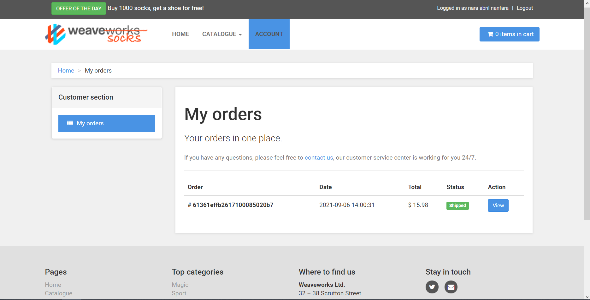

## Trabajo Práctico 4 - Arquitectura de Microservicios

### 1- Objetivos de Aprendizaje
 - Familiarizarse con conceptos de Microservicios

### 2- Unidad temática que incluye este trabajo práctico
Este trabajo práctico corresponde a la unidad Nº: 2 (Libro Ingeniería de Software: Unidad 18)

### 3- Consignas a desarrollar en el trabajo práctico:

A continuación, se presentarán algunos conceptos generales de la arquitectura de microservicios y exploraremos un ejemplo completo y funcional de ejemplo de este tipo de sistemas.

#### Arquitectura
Una arquitectura de microservicios consta de una colección de servicios autónomos y pequeños. Los servicios son independientes entre sí y cada uno debe implementar una funcionalidad de negocio individual.

#### ¿Qué son los microservicios?
- Los microservicios son pequeños e independientes, y están acoplados de forma imprecisa. Un único equipo reducido de programadores puede escribir y mantener un servicio.
- Cada servicio es un código base independiente, que puede administrarse por un equipo de desarrollo pequeño.
- Los servicios pueden implementarse de manera independiente. Un equipo puede actualizar un servicio existente sin tener que volver a generar e implementar toda la aplicación.
- Los servicios son los responsables de conservar sus propios datos o estado externo. Esto difiere del modelo tradicional, donde una capa de datos independiente controla la persistencia de los datos.
- Los servicios se comunican entre sí mediante API bien definidas. Los detalles de la implementación interna de cada servicio se ocultan frente a otros servicios.
- No es necesario que los servicios compartan la misma pila de tecnología, las bibliotecas o los marcos de trabajo.

![alt text][imagen]

[imagen]: microservices-logical.png

(Contenido e Imagen: https://docs.microsoft.com/es-es/azure/architecture/microservices/ )

#### Administración e implementación.
 Este componente es el responsable de la colocación de servicios en los nodos, la identificación de errores, el reequilibrio de servicios entre nodos, etc. Normalmente, este componente es una tecnología estándar, como Kubernetes, en lugar de algo creado de forma personalizada.

#### Puerta de enlace de API 
La puerta de enlace de API es el punto de entrada para los clientes. En lugar de llamar a los servicios directamente, los clientes llaman a la puerta de enlace de API, que reenvía la llamada a los servicios apropiados en el back-end.

Entre las ventajas de usar una puerta de enlace de API se encuentran las siguientes:
- Desacoplan los clientes de los servicios. Los servicios pueden cambiar de versión o refactorizarse sin necesidad de actualizar todos los clientes.
- Los servicios pueden utilizar los protocolos de mensajería que no son fáciles de usar para un servicio web, como AMQP.
- La puerta de enlace de API puede realizar otras funciones transversales como la autenticación, el registro, la terminación SSL y el equilibrio de carga.

## 4- Desarrollo:


#### 1- Instanciación del sistema
- Clonar el repositorio https://github.com/microservices-demo/microservices-demo
```bash
mkdir -p socks-demo
cd socks-demo
git clone https://github.com/microservices-demo/microservices-demo.git
```
- Ejecutar lo siguiente
```bash
cd microservices-demo
docker-compose -f deploy/docker-compose/docker-compose.yml up -d
```
- Una vez terminado el comando `docker-compose` acceder a http://localhost
- Generar un usuario
- Realizar búsquedas por tipo de media, color, etc.
- Hacer una compra - poner datos falsos de tarjeta de crédito ;)




#### 2- Investigación de los componentes
1. Describa los contenedores creados, indicando cuales son los puntos de ingreso del sistema.

**Resolución**

Contenedores creados:

* `edge-router`: punto de ingreso al sistema.
* `front-end`: API gateway, invoca a los diferentes servicios.
* `payment`: provee el servicio de pago.
* `catalogue`: provee el servicio de información de los productos, catálogo.
    * `catalogue-db`: base de datos del catálogo.
* `carts`: provee el servicio de carrito de compras.
    * `carts-db`: base de datos del carrito.
* `orders`: provee el servicio que permite operar con ordenes.
    * `orders-db`: base de datos de las ordenes.
* `user`: provee servicio de cuentas de usuario (con tarjetas y direcciones).
    * `user-db`: base de datos de los usuarios.
    * `user-sim`: load-test, una prueba que simula el uso real de la aplicación por parte de un usuario simulado.
* `shipping`: provee el servicio de compra. Productor de mensajes.
* `rabbitmq`: middleware de mensajería. Cola que almacena los mensajes de shipping hasta que queue-master los consume.
* `queue-master`: Lectura de la cola shipping mediante rabbitmq (procesa las compras). Consumidor de mensajes.

*Una cola de mensajes es una forma de comunicación asíncrona de servicio a servicio que se usa en arquitecturas de microservicios y sin servidor. Los mensajes se almacenan en la cola hasta que se procesan y eliminan. Cada mensaje se procesa una vez sola, por un solo consumidor. Las colas de mensajes se pueden usar para desacoplar procesos pesados, para acumular trabajo y para clasificar cargas de trabajo.*

Todos pertenecen a la red brige `docker-compose_default`


2. Clonar algunos de los repositorios con el código de las aplicaciones
```bash
cd socks-demo
git clone https://github.com/microservices-demo/front-end.git
git clone https://github.com/microservices-demo/user.git
git clone https://github.com/microservices-demo/edge-router.git
.
.
```
3. ¿Por qué cree usted que se está utilizando repositorios separados para el código y/o la configuración del sistema? Explique puntos a favor y en contra.

**Resolución**
Porque el código hace a la funcionalidad de cada microservicio y la configuración del sistema forma la app a partir de la interacción de los diferentes microservicios, de esta forma obtenemos mayor modularidad.

* +Puede cada microservicio evolucionar en su propio entorno de manera independiente (siempre y cuando no rompa el contrato).
* +Da mayor organización a la gestión de configuración y la hace mas entendible.
* +No todos los microservicios tienen por qué desarrollarse usando las mismas metodologías y flujos de trabajo por lo que cada equipo de desarrollo de cada microservicio puede establecer las reglas que crea mejores para el repositorio.
* +Puede reutilizarse los servicios para construir más de un sistema.
* -Mayor complejidad en la configuración para obtener y "encajar" los microservicios.


4. ¿Cuál contenedor hace las veces de API Gateway?

**Resolución**

`docker-compose_front-end_1`


5. Cuando ejecuto este comando:
```bash
curl http://localhost/customers
```

**Resolución**

```bash                                                     
> curl http://localhost/customers

StatusCode        : 200
StatusDescription : OK
Content           : {"_embedded":{"customer":[{"firstName":"Eve","lastName":"Berger","username":"Eve_Berger","id":"57a98d98e4b00679b4a830af","_links":{"addresses":{"href":"http://user/customers/57a98d98e4b00679b4a830af/a...
RawContent        : HTTP/1.1 200 OK
                    Date: Mon, 06 Sep 2021 15:18:16 GMT
                    Set-Cookie: _TRAEFIK_BACKEND=http://front-end:8079,md.sid=s%3AMQYqbgZQ6r5j93505cT9YkajT71c37Vv.lAVULIjB%2Bv9nTv7dX4XMsF6FfPil6SltMYuXWaJYkNw; Path...
Forms             : {}
Headers           : {[Date, Mon, 06 Sep 2021 15:18:16 GMT], [Set-Cookie,
                    _TRAEFIK_BACKEND=http://front-end:8079,md.sid=s%3AMQYqbgZQ6r5j93505cT9YkajT71c37Vv.lAVULIjB%2Bv9nTv7dX4XMsF6FfPil6SltMYuXWaJYkNw; Path=/; HttpOnly], [X-Powered-By, Express], [Content-Length, 1600]...}
Images            : {}
InputFields       : {}
Links             : {}
ParsedHtml        : mshtml.HTMLDocumentClass
RawContentLength  : 1600
```

6. ¿Cuál de todos los servicios está procesando la operación?

**Resolución**

`docker-compose_user_1`

7. ¿Y para los siguientes casos?
```bash
curl http://localhost/catalogue
curl http://localhost/tags
```

**Resolución**

```bash
> curl http://localhost/catalogue


StatusCode        : 200
StatusDescription : OK
Content           : [{"id":"03fef6ac-1896-4ce8-bd69-b798f85c6e0b","name":"Holy","description":"Socks fit for a Messiah. You too can experience walking in water with these special edition beauties. Each hole is lovingly p...
RawContent        : HTTP/1.1 200 OK
                    Date: Mon, 06 Sep 2021 15:57:54 GMT
                    Set-Cookie: _TRAEFIK_BACKEND=http://front-end:8079,md.sid=s%3A220bc3gC_YbBA5tEY9dcEh0nlDKkQqhV.6TeQzQxxf4eql%2B%2BTjhtbVrDlVN24QvId9rqNfJufGgU; Pa...
Forms             : {}
Headers           : {[Date, Mon, 06 Sep 2021 15:57:54 GMT], [Set-Cookie, _TRAEFIK_BACKEND=http://front-end:8079,md.sid=s%3A220bc3gC_YbBA5tEY9dcEh0nlDKkQqhV.6TeQzQxxf4eql%2B%2BTjhtbVrDlVN24QvId9rqNfJufGgU; Path=/; HttpOnly],
                    [X-Powered-By, Express], [Content-Type, text/plain; charset=utf-8]...}
Images            : {}
InputFields       : {}
Links             : {}
ParsedHtml        : mshtml.HTMLDocumentClass
RawContentLength  : 2795


> curl http://localhost/tags


StatusCode        : 200
StatusDescription : OK
Content           : {"tags":["brown","geek","formal","blue","skin","red","action","sport","black","magic","green"],"err":null}

RawContent        : HTTP/1.1 200 OK
                    Date: Mon, 06 Sep 2021 15:58:10 GMT
                    Set-Cookie: _TRAEFIK_BACKEND=http://front-end:8079,md.sid=s%3AwhvrvJOM2PjRhSw4v8w10PGoVCJtKjZu.KYXjyW7AfSF%2FJLYmIwuQ9JZZ70ihjRSNnve4hr23wK4; Path...
Forms             : {}
Headers           : {[Date, Mon, 06 Sep 2021 15:58:10 GMT], [Set-Cookie, _TRAEFIK_BACKEND=http://front-end:8079,md.sid=s%3AwhvrvJOM2PjRhSw4v8w10PGoVCJtKjZu.KYXjyW7AfSF%2FJLYmIwuQ9JZZ70ihjRSNnve4hr23wK4; Path=/; HttpOnly],
                    [X-Powered-By, Express], [Content-Length, 107]...}
Images            : {}
InputFields       : {}
Links             : {}
ParsedHtml        : mshtml.HTMLDocumentClass
RawContentLength  : 107
```

En ambos casos los procesa catalogue.

8. ¿Como perisisten los datos los servicios?

**Resolución**

En 3 bases de datos: una destinada a usuarios, otra a catalogo y otra a ordenes.

A estas se les asignan espacios de memoria temporales (tmpfs), por lo que al dar de baja los servicios sus datos se pierden, lo cual no sucedería si se le asignara un volumen.


9. ¿Cuál es el componente encargado del procesamiento de la cola de mensajes?

**Resolución**

`docker-compose_queue-master_1`


10. ¿Qué tipo de interfaz utilizan estos microservicios para comunicarse?

**Resolución**

# Generalmente interfaces restful que es un URL que devuelve un jso, xml o texto; o gRPC para alta performance
