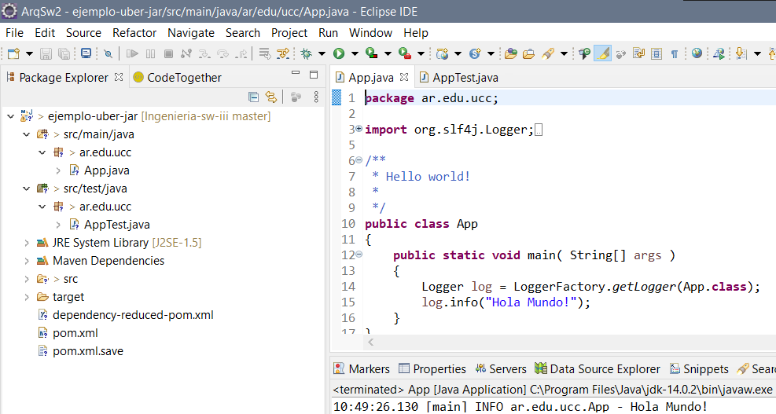
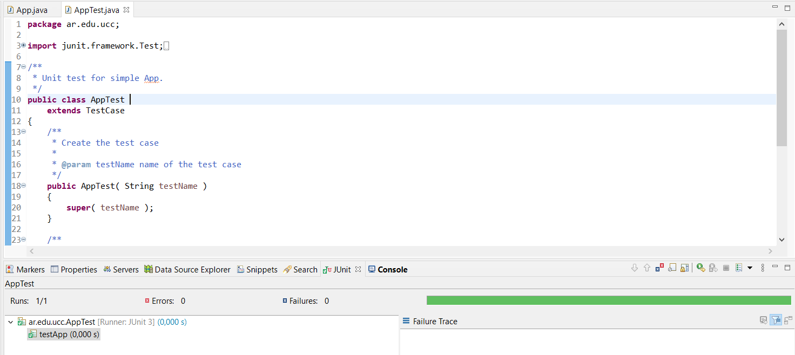
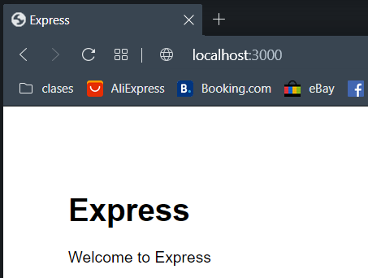

## Trabajo Práctico 5 - Herramientas de construcción de software

### 1- Objetivos de Aprendizaje
 - Utilizar herramientas de construcción de software y manejo de paquetes y dependencias
 - Familiarizarse con las herramientas más utilizadas en el lenguaje Java.

### 2- Unidad temática que incluye este trabajo práctico
Este trabajo práctico corresponde a la unidad Nº: 3 (Libro Continuous Delivery: Cap 6 y 13)

### 3- Consignas a desarrollar en el trabajo práctico:
  - Las aplicaciones utilizadas son del tipo "Hello World", dado que el foco del trabajo práctico es como construirlas y no el funcionamiento de la aplicación en sí.
  - En los puntos en los que se pida alguna descripción, realizarlo de la manera más clara posible.

### 4- Desarrollo:

#### 1- Instalar Java JDK si no dispone del mismo. 
  - Java 8 es suficiente, pero puede utilizar cualquier versión.
  - Utilizar el instalador que corresponda a su sistema operativo 
  - http://www.oracle.com/technetwork/java/javase/downloads/jdk8-downloads-2133151.html
  - Agregar la variable de entorno JAVA_HOME
    - En Windows temporalmente se puede configurar
    ```bash
      SET JAVA_HOME=C:\Program Files\Java\jdk1.8.0_221
    ```
    - O permanentemente entrando a **Variables de Entorno** (Winkey + Pausa -> Opciones Avanzadas de Sistema -> Variables de Entorno)
  - Otros sistemas operativos:
    - https://www3.ntu.edu.sg/home/ehchua/programming/howto/JDK_Howto.html
    - https://www.digitalocean.com/community/tutorials/how-to-install-java-with-apt-on-ubuntu-18-04


#### 2- Instalar Maven
- Instalar maven desde https://maven.apache.org/download.cgi (última versión disponible 3.6.1)
- Descomprimir en una carpeta, por ejemplo C:\tools
- Agregar el siguiente directorio a la variable de entorno PATH, asumiendo que los binarios de ant están en C:\tools\apache-maven-3.6.1\bin

  ```bash   
    SET PATH=%PATH%;C:\tools\apache-maven-3.6.1\bin
  ```  
- Se puede modificar permanentemente la variable PATH entrando a (Winkey + Pausa -> Opciones Avanzadas de Sistema -> Variables de Entorno)
- En Linux/Mac se puede agregar la siguiente entrada al archivo ~/.bash_profile

  ```bash
  export PATH=/opt/apache-maven-3.6.1/bin:$PATH
  ```

#### 3- Introducción a Maven
- Qué es Maven?

*Es una herramienta de compresión y gestión de proyectos, lo que hace es estandarizar la configuración de un proyecto en todo su ciclo de vida.*

- Qué es el archivo POM?

*POM (Project Object Model) es la representación XML de un proyecto Maven. Contiene toda la información necesaria sobre un proyecto, así como las configuraciones de complementos que se utilizarán en el momento de compilación.*

  1. modelVersion

  *Contiene la versión del modelo del POM.*

  2. groupId
  
  *Define el dominio, el proyecto real al que pertenece el proyecto Maven actual, suele ser único en una organización o proyecto. Cada artifact tiene un groupId.*

  3. artifactId
  
  *Define un módulo maven, nombre del artifact sin la versión, generalmente del tipo jar.*

  4. versionId
  
  *Versión del artifact.*

  *Estos 3 (groupId, artifactId y versionId) en conjunto identifican un artifact.*

- Repositorios Local, Central y Remotos http://maven.apache.org/guides/introduction/introduction-to-repositories.html

*Repositorio local: reside en la computadora donde se ejecuta Maven. Cachea descargas remotas y contiene comtiene artifacts de compilación temporales.*

*Repositorio central: localizado en `http://repo.maven.apache.org/maven2/`. Cuando se compila, maven primero intenta encontrar la dependencia en el repositorio local. Si no esta ahí, por defecto, activa la descarga desde este repositorio central. Es el repositorio remoto por defecto.*

*Repositorio remoto: cualquier otro repositorio al que se accede mediante protocolos como `file://` o `https://`. Siempre que se necesita un artifact de estos repositorios, primero se descarga al repositorio local del desarrollador y luego se utiliza.*

- Entender Ciclos de vida de build
  - default

    *Maneja el deployment del proyecto*
  - clean

    *Maneja la limpieza del proyecto, elimina los arcivos generados.*
  - site

    *Maneja la creación de el sitio web del proyecto.*
  - Referencia: http://maven.apache.org/guides/introduction/introduction-to-the-lifecycle.html#Build_Lifecycle_Basics
- Comprender las fases de un ciclo de vida, por ejemplo, default:

| Fase de build | Descripción                                                                                                                            |
|---------------|----------------------------------------------------------------------------------------------------------------------------------------|
| validate      | valida si el proyecto está correcto y toda la información está disponible                                                             |
| compile       | compila el código fuente del proyecto                                                                                 |
| test          | prueba el código fuente compilado utilizando un marco de prueba de unidad adecuado. Estas pruebas no deberían requerir que el código se empaquete o implemente |
| package       | toma el código compilado y lo empaqueta en su formato distribuible, como un JAR.                                                     |
| verify        | ejecuta cualquier verificación de los resultados de las pruebas de integración para garantizar que se cumplan los criterios de calidad                                                      |
| install       | instala el paquete en el repositorio local, para usarlo como dependencia en otros proyectos localmente                                       |
| deploy        | hecho en el entorno de compilación, copia el paquete final en el repositorio remoto para compartirlo con otros desarrolladores y proyectos.      |


| Fase clean | Descripción                                                                                                                            |
|---------------|----------------------------------------------------------------------------------------------------------------------------------------|
| pre-clean      | ejecuta los procesos necesarios antes de la limpieza real del proyecto                                                             |
| clean       | elimina todos los archivos generados por la compilación anterior                                                                                 |
| post-clean          | Ejecuta procesos prosteriores para finalizar la limpieza del proyecto |


| Fase site | Descripción                                                                                                                            |
|---------------|----------------------------------------------------------------------------------------------------------------------------------------|
| pre-site      | Eejecuta los procesos necesarios antes de la generación real del sitio                                                             |
| site       | Genera la documentación del sitio del proyecto                                                                                 |
| post-site          | Ejecuta los procesos necesarios para finalizar la generación del sitio y prepara para el deployment |
| site-deploy       | Deploya la documentación del sitio generada en el servidor web especificado                                                     |

- Copiar el siguiente contenido a un archivo, por ejemplo ./trabajo-practico-02/maven/vacio/pom.xml

```xml
<project xmlns="http://maven.apache.org/POM/4.0.0"
         xmlns:xsi="http://www.w3.org/2001/XMLSchema-instance"
         xsi:schemaLocation="http://maven.apache.org/POM/4.0.0
                      http://maven.apache.org/xsd/maven-4.0.0.xsd">
    <modelVersion>4.0.0</modelVersion>

    <groupId>ar.edu.ucc</groupId>
    <artifactId>proyecto-01</artifactId>
    <version>0.1-SNAPSHOT</version>
</project>
```

- Ejecutar el siguiente comando en el directorio donde se encuentra el archivo pom.xml
```
mvn clean install
```

- Sacar conclusiones del resultado

*Este comando ejecuta la fase clean y luego compienza la compilación desde un estado limpio. Como resultado se instalaron una serie de archivos jar desde el repositorio centrar y se creó el proyecto maven y el ejecuteble .jar correspondiente a este.*

#### 4- Maven Continuación

- Generar un proyecto con una estructura inicial:

```bash
mvn archetype:generate -DgroupId=ar.edu.ucc -DartifactId=ejemplo -DarchetypeArtifactId=maven-archetype-quickstart -DinteractiveMode=false
```

- Analizar la estructura de directorios generada:

```
.
└── ejemplo
    ├── pom.xml
    └── src
        ├── main
        │   └── java
        │       └── ar
        │           └── edu
        │               └── ucc
        │                   └── App.java
        └── test
            └── java
                └── ar
                    └── edu
                        └── ucc
                            └── AppTest.java

12 directories, 3 files
```

- Compilar el proyecto

```bash
mvn clean package
```

- Analizar la salida del comando anterior y luego ejecutar el programa

**Salida**
```bash
Running ar.edu.ucc.AppTest
Tests run: 1, Failures: 0, Errors: 0, Skipped: 0, Time elapsed: 0.017 sec

Results :

Tests run: 1, Failures: 0, Errors: 0, Skipped: 0
```
*Se crea target.*

```
java -cp target/ejemplo-1.0-SNAPSHOT.jar ar.edu.ucc.App
```
*Este comando imprime `"Hello world!"`*
#### 6- Manejo de dependencias

- Crear un nuevo proyecto con artifactId **ejemplo-uber-jar**

- Modificar el código de App.java para agregar utilizar una librería de logging:

```java
package ar.edu.ucc;

import org.slf4j.Logger;
import org.slf4j.LoggerFactory;

/**
 * Hello world!
 *
 */
public class App 
{
    public static void main( String[] args )
    {
        Logger log = LoggerFactory.getLogger(App.class);
        log.info("Hola Mundo!");
    }
}
```

- Compilar el código e identificar el problema.

```bash
[ERROR] package org.slf4j does not exist
[ERROR] package org.slf4j does not exist
```
*El problema reside en que no puedeimportar Logger y LoggerFactory*

- Agregar la dependencia necesaria al pom.xml

```xml
    <dependency>
      <groupId>ch.qos.logback</groupId>
      <artifactId>logback-classic</artifactId>
      <version>1.2.1</version>
    </dependency>
```

- Verificar si se genera el archivo jar y ejecutarlo

```bash
C:.
│   pom.xml
│
├───src
│   ├───main
│   │   └───java
│   │       └───ar
│   │           └───edu
│   │               └───ucc
│   │                       App.java
│   │
│   └───test
│       └───java
│           └───ar
│               └───edu
│                   └───ucc
│                           AppTest.java
│
└───target
    │   ejemplo-uber-jar-1.0-SNAPSHOT.jar
```

```bash
java -cp target\ejemplo-uber-jar-1.0-SNAPSHOT.jar ar.edu.ucc.App
```

- Sacar conclusiones y analizar posibles soluciones
**Salida**
```bash
Exception in thread "main" java.lang.NoClassDefFoundError: org/slf4j/LoggerFactory
        at ar.edu.ucc.App.main(App.java:14)
Caused by: java.lang.ClassNotFoundException: org.slf4j.LoggerFactory
        at java.net.URLClassLoader.findClass(Unknown Source)
        at java.lang.ClassLoader.loadClass(Unknown Source)
        at sun.misc.Launcher$AppClassLoader.loadClass(Unknown Source)
        at java.lang.ClassLoader.loadClass(Unknown Source)
        ... 1 more
```
*Aún añadiendo las dependencias en el `pom.xml` la clase que se intenta importar (LoggerFactory) no es encontrada porque esta especificación es útil en el momento de compilación (lo que justifica que antes de añadir las dependencias a `pom.xml` no era posible la compilación) pero al momento de linkear la clase no puede ser alcanzada, tenemos dos posibilidades: hacer un ejecutable "gordo", que no solo contenga nuestra aplicación sino también las librerias, algo así como un linkeo estático, es lo que se logra con el código del punto siguiente; la otra alternativa es optar por un linkeo dinámico, con este vamos a tener que especificar de alguna forma (como puede ser en el comando de ejecución) donde están los jar's que tiene que acceder para ejecutar correctamente nuestro proyecto.*

- Implementar la opción de uber-jar: https://maven.apache.org/plugins/maven-shade-plugin/

```xml
  <build>
    <plugins>
      <plugin>
        <groupId>org.apache.maven.plugins</groupId>
        <artifactId>maven-shade-plugin</artifactId>
        <version>2.0</version>
        <executions>
          <execution>
            <phase>package</phase>
            <goals>
              <goal>shade</goal>
            </goals>
            <configuration>
              <finalName>${project.artifactId}</finalName>
              <transformers>
                <transformer implementation="org.apache.maven.plugins.shade.resource.ManifestResourceTransformer">
                  <mainClass>ar.edu.ucc.App</mainClass>
                </transformer>
              </transformers>
              <minimizeJar>false</minimizeJar>
            </configuration>
          </execution>
        </executions>
      </plugin>
    </plugins>
  </build>
```
- Volver a generar la salida y probar ejecutando

```bash
java -jar target\ejemplo-uber-jar.jar
```

*Salida*
```bash
>java -cp target\ejemplo-uber-jar-1.0-SNAPSHOT.jar ar.edu.ucc.App
19:09:40.772 [main] INFO ar.edu.ucc.App - Hola Mundo!
```

#### 7- Utilizar una IDE
  - Importar el proyecto anterior en Eclipse o Intellij como maven project:
    - Si no dispone de Eclipse puede obtenerlo desde este link http://www.eclipse.org/downloads/packages/release/2018-09/r/eclipse-ide-java-ee-developers
    - Para importar, ir al menú Archivo -> Importar -> Maven -> Proyecto Maven Existente:

    - Seleccionar el directorio donde se encuentra el pom.xml que se generó en el punto anterior. Luego continuar:


  - Familiarizarse con la interfaz grafica
    - Ejecutar la aplicación
    - Depurar la aplicación
    - Correr unit tests y coverage
    - Ejecutar los goals de maven
    - Encontrar donde se puede cambiar la configuración de Maven.
    - etc.

    
    

#### 8- Ejemplo con nodejs

- Instalar Nodejs: https://nodejs.org/en/

- Instalar el componente para generar aplicaciones Express

```bash
npm install express-generator -g
```

- Crear una nueva aplicación
```bash
express --view=ejs hola-mundo
```

- Ejecutar la aplicación

```bash
cd hola-mundo
npm install
npm start
```

- La aplicación web estará disponible en http://localhost:3000



- Analizar el manejo de paquetes y dependencias realizado por npm.

**Analisis**

NPM consiste de dos partes principales:

- Una herramienta CLI (interfaz de línea de comandos) para la publicación y descarga de paquetes, y
- Un repositorio en línea que alberga paquetes de JavaScript

Podemos pensar en el repositorio npmjs.com como un centro de cumplimiento que recibe paquetes de bienes de los vendedores (autores de paquetes npm) y los distribuye a los compradores (usuarios de paquetes npm).

Para facilitar este proceso, el centro de cumplimiento npmjs.com emplea un ejército de trabajadores (npm CLI) que serán asignados como asistentes personales a cada cliente individual de npmjs.com.*

Cada proyecto en JavaScript puede ser enfocado como un paquete npm con su propia información de paquete y su archivo package.json para describir el proyecto.

package.json se generará cuando se ejecute npm init para inicializar un proyecto JavaScript/Node.js, con estos metadatos básicos proporcionados por los desarrolladores: name, version, description y license.

En nuestro caso el contenido es:

```json
{
  "name": "hola-mundo",
  "version": "0.0.0",
  "private": true,
  "scripts": {
    "start": "node ./bin/www"
  },
  "dependencies": {
    "cookie-parser": "~1.4.4",
    "debug": "~2.6.9",
    "ejs": "~2.6.1",
    "express": "~4.16.1",
    "http-errors": "~1.6.3",
    "morgan": "~1.9.1"
  }
}

Las dependencias vienen en forma de objetos clave-valor (key-value) con los nombre de las librerías npm como clave y sus versiones en formato semántico como valor. Estas dependencias se instalan mediante el comando npm install con las banderas --save y --save-dev. `~` hace referencia a la última versión del parche.

package.json es una etiqueta descriptiva genérica, mientras que el archivo package-lock.json describe las versiones exactas de las dependencias utilizadas en un proyecto de JavaScript npm, es usualmente generado por el comando npm install.

Un npm install dentro del contexto de un proyecto npm descargará los paquetes en la carpeta node_modules del proyecto según las especificaciones de package.json, actualizando la versión del paquete (y a su vez regenerando package-lock.json).

```


#### 9- Ejemplo con python
- Instalar dependencias (Ejemplo Ubuntu) varía según el OS:
```
sudo apt install build-essential python3-dev
pip3 install cookiecutter
```
- Correr el scaffold
```bash
$ cookiecutter https://github.com/candidtim/cookiecutter-flask-minimal.git
application_name [Your Application]: test
package_name [yourapplication]: test
$
```
- Ejecutar la aplicación
```bash
cd test
make run
```
- Acceder a la aplicación en: http://localhost:5000/
- Explicar que hace una tool como cookiecutter, make y pip.

**Explicación**

- *cookiecutter* proporciona una interfaz gráfica de usuario para descubrir plantillas, opciones de plantilla de entrada y crear proyectos y archivos. Crea proyectos a partir de plantillas de proyectos.

- *make* Utilidad para construir y mantener grupos de programas. El propósito de la utilidad make es determinar automáticamente qué partes de un programa necesitan ser recompiladas y emitir los comandos para recompilarlas. Puede usar make con cualquier lenguaje de programación cuyo compilador se pueda ejecutar con un comando de shell. Puede usarlo para describir cualquier tarea en la que algunos archivos deban actualizarse automáticamente desde otros siempre que los otros cambien. Debe especificar un archivo makefile que describa las relaciones entre los archivos en su programa y los estados de los comandos para actualizar cada archivo. En un programa, normalmente el archivo ejecutable se actualiza a partir de archivos objeto, que a su vez se compilan mediante la compilación de archivos fuente. Se usa para compilar y likear codigo, hace más facil la compilación.
  
  En nuestro caso:
```make
    all: run

clean:
	rm -rf venv && rm -rf *.egg-info && rm -rf dist && rm -rf *.log*

venv:
	virtualenv --python=python3 venv && venv/bin/python setup.py develop

run: venv
	FLASK_APP=test TEST_SETTINGS=../settings.cfg venv/bin/flask run

test: venv
	TEST_SETTINGS=../settings.cfg venv/bin/python -m unittest discover -s tests

sdist: venv test
	venv/bin/python setup.py sdist
```
- *pip* es una herramienta de línea de comandos que permitirá instalar, reinstalar y desinstalar paquetes de Python, además de resolver automáticamente las dependencias de cada uno de estos paquetes. 


#### 10- Build tools para otros lenguajes
- Hacer una lista de herramientas de build (una o varias) para distintos lenguajes, por ejemplo (Rust -> cargo)
- Elegir al menos 10 lenguajes de la lista de top 20 o top 50 de tiobe: https://www.tiobe.com/tiobe-index/

  * C -> Cheesemake, 
  * C++ -> Make, CMake, Ninja.
  * C# -> Cake (C# Make), MSBuild.
  * JS -> Webpack, Grunt, Gulp, Browserify,Brunch, Yeoman.
  * Perl -> Perl Build System.
  * php -> Phing.
  * Swift -> llbuild, Swift Package Manager.
  * Go -> Task, Make.
  * Visual Basic -> Microsoft Build Engine (MSBuild).
  * Groovy -> Gradle.

#### 11- Presentación

- Subir todo el código, ejemplos y respuestas a una carpeta trabajo-practico-05.

> Tip: Agregar un archivo .gitignore al repositorio para evitar que se agreguen archivos que son resultado de la compilación u otros binarios, que no son necesarios, al mismo.
